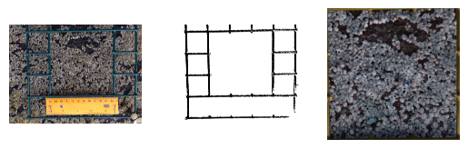
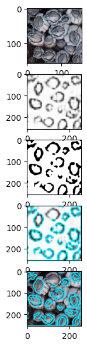
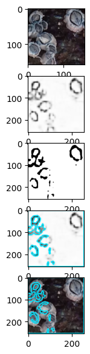
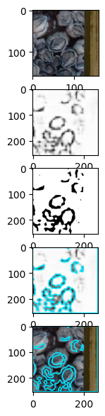
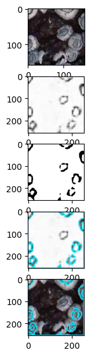

# Counting Barnacles

## Problem

Our goal is to speed up the counting process of barnacles in an image. This will help speed up the very tedious process that scientists must go through to manually count for each image.

## First Thoughts

- Each photo is taken with a grid, we probably want to isolate this area before we continue any procession

- A single image can contain thousands of barnacles, we probably will want to divide the area so we have less to worry about in each image.

- Training an model to match a mask will allow us to generate a mask for new images. We can then count the components in this new image to get an estimate of the barnacle count in the new image

## Subtask

My goal for this project is to create a machine learning model that will be create a mask outline for (ideally) all of the barnacles in an image.

This will involve the following steps:

- Isolating the area of interest

  - We only want to count the barnacles within the frame. However there is a lot of space in the image that we want to ignore. So, we must find a way to isolate the part of the image that is within the green frame

- Segmenting the search space

  - This is just breaking the search space into smaller areas, which both gives us more training data, and makes the task more managable (less barnacles per image)

- Training the model

  - Because there is so little training data, we want to use a pre-trained model and fine-tune it on our task. The input will be a raw segment of the image, and the output will be a mask that ideally highlights the outline of barnacles in the image

- Contours

  - The model will not output perfect outlines of barnacles, so it would be helpful to include some post-processing to make the outlines more well-defined

  - We can count the contours in an image to estimate the number of barnacles in the image

## Methodology

### Cropping Frame

Because we only want to count the barnacles within the frame, it is helpful to crop images to only include the space within the frame. To do this, we load the image using OpenCV, and convert the image from BGR to HSV. We then filter the image to set all values in the HSV range of (35,50,10) to (100,255,255) to black, and all other values to white. This effectively turns all green pixels in the image to black, and all other pixels to white, thus making the frame clear in the image. This assumes that pixels that are not part of the frame in the image are largely not green.

Next, we perform the closing morphological operation on the image, with a rectangular kernel of size 5 x 5. This removes some of the small black wholes that may remain in the image.

Then, we use OpenCV to find contours in the image. We then search for the contour with the largest rectangular bounding box that is approximately square (0.9 < w*h < 1.1) and less than 7,000,000 pixels in area. These numbers may need to be tuned depending on quality and resolution of photos. We return the bounds of this largest square bounding box.

### Segmenting Images

Given a frame of barnacles, it is more practical to subdivide the frame into segments in order to create a more managable task for the machine learning model.

To do this, we divide each image into 100 segments (10x10). We also divide corresponding masks in the same way.

Before being input to the model, images are resized to 256 x 256 pixels.

### Train/Validation Split

We randomly select 20% of the training images to be used for validation. These selected images are never seen during model training. Validation loss is used to evaluate model performance.

### Model

We use the pretrained torchvision's FCN with Resnet-50 backbone model. We modify the output layer to be a 2D convolutional layer with 512 input channels, 1 output channel, and a kernel size of 1. We use BCE loss, and the Adam optimizer, with a learning rate of 10^-4. We train the model for 10 epochs with a batch size of 4.

### Generating Masks and Contours

Given the output of the model, we perform the sigmoid function on it to get values between 0 and 1. We then use OpenCV to normalize it to be a normal graycale image. Then, we use Otsu's thresholding to get a mask. To enhance the mask, we perform the opening morphological operation with a 5 x 5 ellipse kernel.

To count the barnacles, we count the contours with area of at least 100 pixels.

## Prototype Results + Analysis

We begin by isolating the frame from the whole original photo. We achieve this by isolating green HSV values. Next, we perform some morphological transformations to increase the definition of the frame. Then, we use OpenCV to identify the largest approximately-square contour in the isolated image. All provided images that included a frame, this appears to work appropriately, but it may fail in unforseen cases. This process works under the assumption that images are taked directly above the frame, and the entire frame is visible in the image. We show this process below:

This shows the original image, the processed image, and the resulting zoomed in image.

We then split each of the two resulting zoomed images into 100 subsections each. In processing the subsections of the frame, we randomly generate a 80/20 split for training and validation.

Because we have such little training data, we utilize FCN Resnet-50, a model especially good at segmentation. We finetune this model to learn how to take a raw input image of barnacles and output the corresponding mask.

On validation segments, we achieve a validation loss of around 0.118 in 7 epochs, which decreased from 0.388 in the first epoch. 

Qualitatively the results appear very promising. The model is able to generate relatively accurate masks of various unseen barnacle images:

   

From top down: Row 1 is the original image used as input to the model. Row 2 is the output of the model. Row 3 is the post-processed model increase the discernability of edges for OpenCV to find contours more reliably. Row 4 is Row 2 with the final mask overlayed. Row 5 is Row 1 iwth the final mask overlayed.

Rows 2 and 3 show that the model is able to very well detect barnacles. Outlines of elliplital objects in these rows generally indicate the prescence of a barnacle at that location. 

Rows 4 and 5 also show potential in using contours to count the number of barnacles in an image. However, disconnections in barnacle masks and overlaps between multiple barnacle masks can create difficulties in this approach. While some post-processing with morphological transformations assisted with creating a more accuract count, there are definitely some improvements that could be made here. For example, a small regression model could be trained to estimate the number of barnacles in an image.

## Conclusions

This process shows the promising approach of using convolutional neural networks to speed up the process of counting barnacles in an image. The task is very tedious, and automating it would provide scientists with more bandwith to work on other tasks. Masks generated by the fine-tuned FCN Resnet-50 model are accurate and helpful.

## Future Work

While the masks generated by the model are very good, and mostly accurate, counting accurately has yet to be addressed properly. Future work could explore this problem, potentially developing a regression model to count the number of barnacles present in a given mask. Additionally, all aspects of this process must be tested with more data, because we are given very little data to work with in the first place. To further the effectiveness of our limited data, data augmentation could be implemented to provide the model with more unique cases. However, this project remains a good proof of concept for addressing the problem of barnacle counting using machine learning techniques. 

## Learning Process

While I am already relatively experienced in machine learning techniques, this project taught me a lot about processing images with OpenCV. I had known about OpenCV, but I had never directly worked with it. In this project, I learned how to filter images using HSV values, how to increase the clarity of my edges using morphological transformations, and how to use contours to extract information from an image. This project was very interesting, and taught me more about image processing. There is a lot one can do without even touching a machine learning model.

## Notebook

Here I outline how to use the notebook `findBarnacles.ipynb`

### Dependencies

- python 3.11

- numpy 2.1.3

- ipykernel 6.29.5

- matplotlib 3.9.3

- opencv-python 4.10.0.84

- torch 2.5.1

- torchvision 0.20.1

### Files

The only necessary files are the notebook itself, the `barn` directory, which contains `utils.py`, and the extracted `Barnacles` directory, which came from the provided zip file on the DALI website. All other files will be generated by the notebook.

The `utils.py` file contains some data processing functions, along with the `BarnacleDataset` class which is used to load in data.

The notebook itself contains code to run the project.

### Reproducing results

Results can be entirely repreduced by running all cells of the notebook.